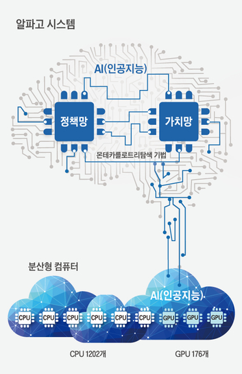

```{r setup, include=FALSE}
knitr::opts_chunk$set(echo = TRUE)
```

- 숙명여자대학교에서 제공하는 [숙명나노디그리](https://mooc.sookmyung.ac.kr/courses/5ffeaa6884bf0238bb1831f2) 중, 모두를 위한 클라우드 컴퓨팅 Ⅰ 과정입니다.  

# 클라우드 컴퓨팅 Ⅰ
## 1-1. 강의소개
### 무엇을 배우는 수업인가?
- 클라우드 컴퓨팅 기초 개념
  - 기업 / 일반 사용자 ← 인터넷 → 클라우드 컴퓨팅

### 왜 배워야 하는가?
- 4차 산업혁명 시대
  - 모든 것이 연결되고 보다 지능적인 사회로의 진화 (다보스 포럼, 2016)
  - 방대한 데이터를 효과적으로 축적, 관리하고 가치 창출로 이어지게 하기 위한 컴퓨터 파워의 필요성
  
- 4차 산업혁명의 가장 근본적인 특징
  - 디지털로의 변환과 연결 및 공유가 중요해진 서비스 산업

- 클라우드 기술에 대한 투자 증가
  - 18년 NIPA '2020년 국내 클라우드 시장 규모 2조원 돌파 예성, 정부의 공공분야 클라우드 도입률 40%로 확대'
  - 국내 클라우드 시장 점령 속도를 높이고 있는 글로벌 클라우드 기업(AWS, MS, IBM 등)
  - 미국, 독일 등 선진국 기업의 약 70%가 클라우드 컴퓨팅 서비스 사용

### 실생활에서 찾아보기: 알파고

| |이세돌|알파고|
|---|---|---|
|프로경력|21년|1년|
|경험|1만 게임|10만 게임|
|훈련|3만 시간|3만 시간(GPU 구동)|
|검색|초당 100지점| 초당 10만 지점|
|연산 능력|인간 한 명의 두뇌|1202 CPUs, 176 GPUs|
|2015년 성적|53승 27패|8승 2패(vs 판후이), 494승 1패(vs 컴퓨터)|
|특징|전투적, 실리형|전략적, 안정형|

- 알파고의 구조



- 알파고 기술로 살펴보는 클라우드의 이점
  - 알파고와 관련된 모든 인프라는 미국 서부의 구글 데이터센터에 위치
  - '구글 클라우드 플랫폼'을 통해 컴퓨팅 자원을 사용해 물리적 제약을 급격히 감소시킴
  - 개별 기업에게 부담될 수 있는 빅데이터 기술을 위한 방대한 컴퓨팅 자원과 인공지능 개발을 위한 슈퍼컴퓨터 비용 절약
  - 클라우드를 통해 중소기업 또는 스타트업에서 대규모 컴퓨팅 자원을 저렴하게 사용 가능


## 1-2. 컴퓨터 기초(1): 컴퓨터 구성요소와 동작원리
### 주기억장치


